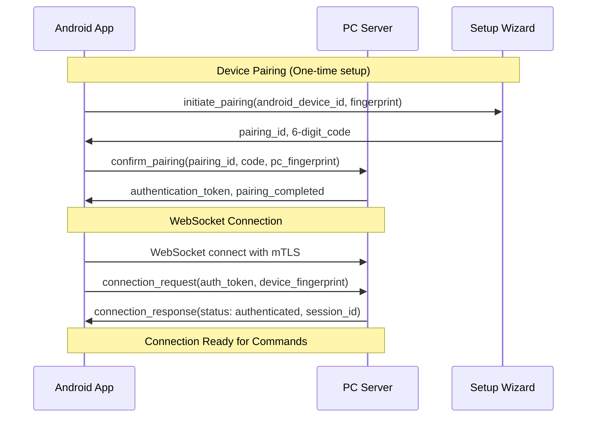
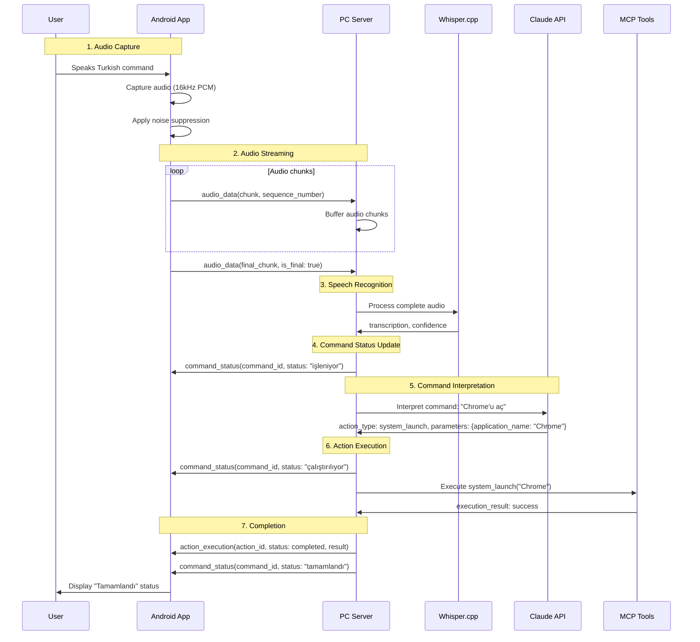
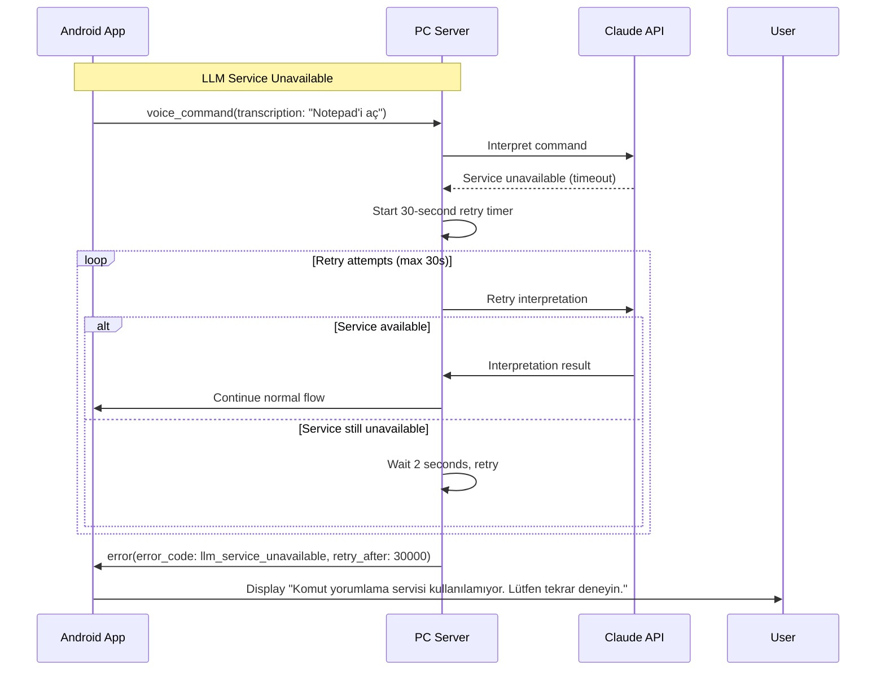
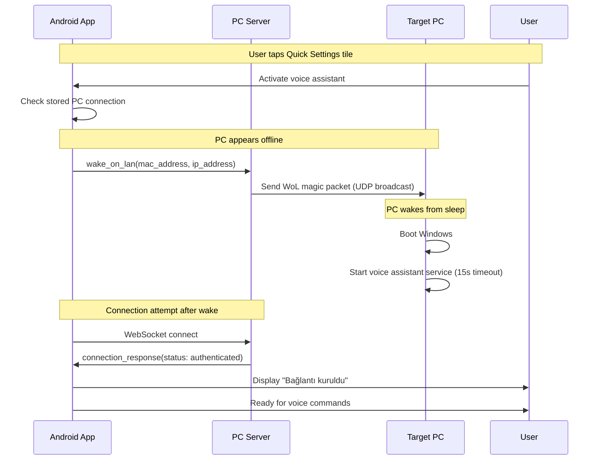
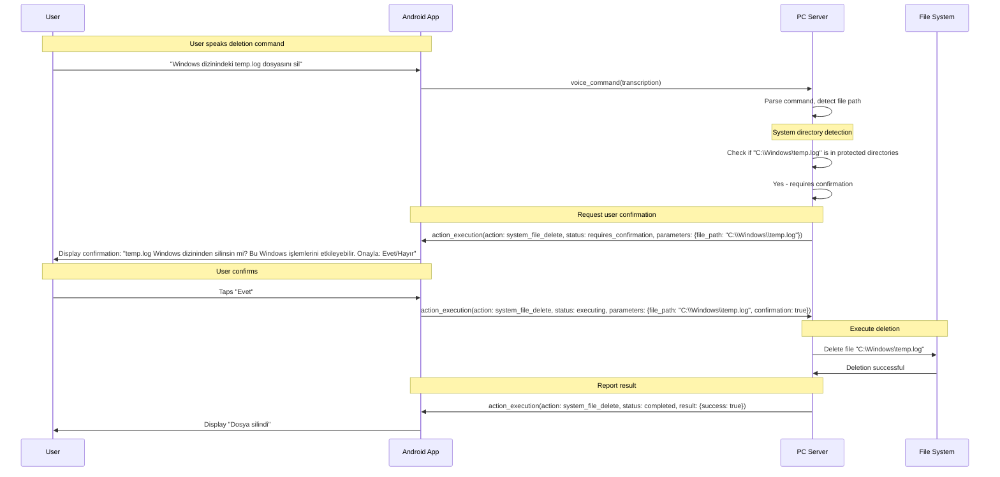
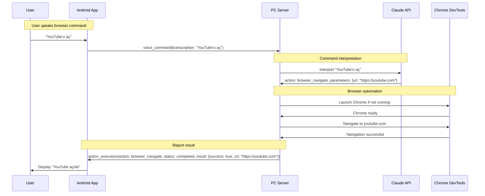
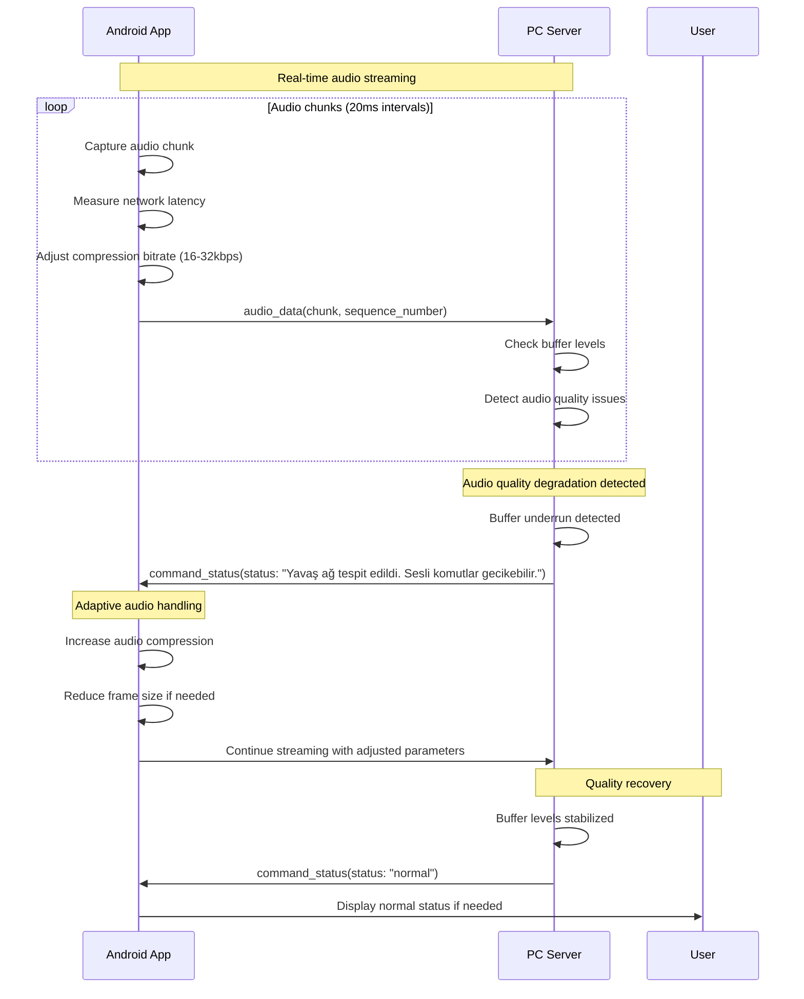
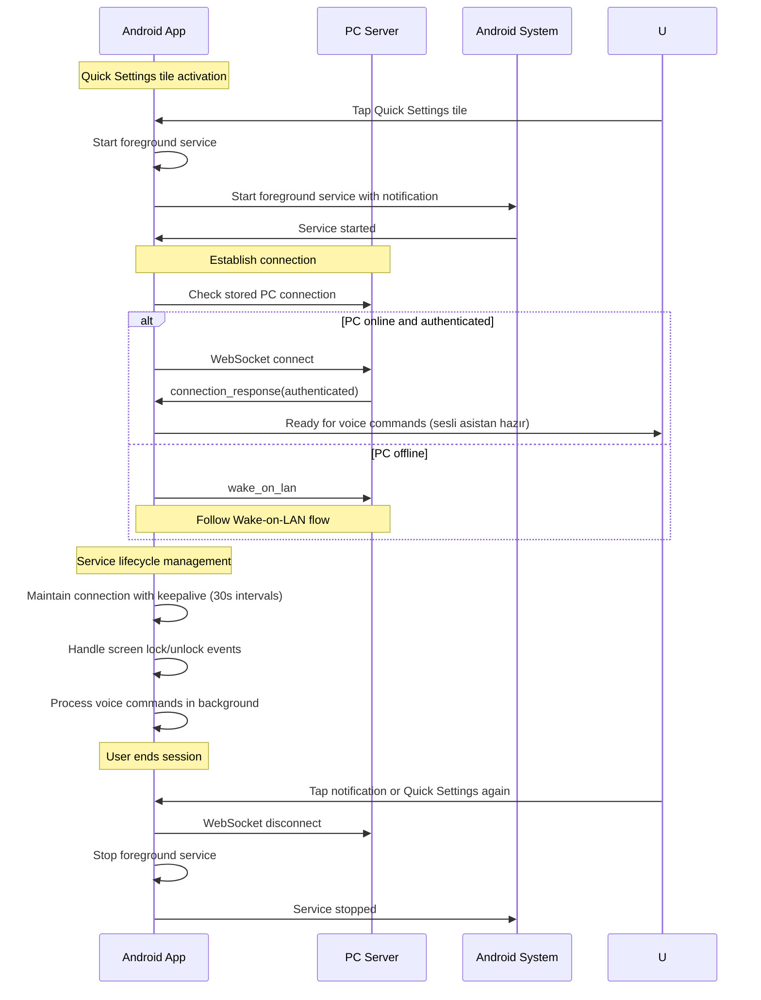

# Message Flow Documentation

**Branch**: 001-voice-pc-control | **Date**: 2025-11-18
**Purpose**: Detailed message flow diagrams for WebSocket communication

## Connection Establishment Flow



## Voice Command Processing Flow



## Error Handling Flow



## Wake-on-LAN Flow



## File Deletion Confirmation Flow



## Browser Control Flow



## Connection Recovery Flow

```mermaid
sequenceDiagram
    participant A as Android App
    participant P as PC Server
    participant N as Network

    Note over A,P: Active voice command session
    A->>P: voice_command("sesi yüzde 50'ye ayarla")
    P->>P: Processing command...

    Note over N: Network disruption occurs
    N-->>A: Connection lost
    N-->>P: Connection lost

    Note over A: Automatic reconnection
    A->>A: Detect connection loss
    A->>A: Start exponential backoff: 1s, 2s, 4s, 8s, 16s, 30s
    loop Reconnection attempts
        A->>P: Attempt WebSocket connection
        alt Connection successful
            P->>A: connection_response(authenticated)
            A->>P: Resend any pending commands
            break
        else Connection failed
            A->>A: Wait backoff period, retry
        end
    end

    Note over A,U: Report to user
    A->>U: Show reconnection status and resume normal operation
```

## Audio Quality Management Flow



## Session Management Flow



## Message Type Reference

### Connection Messages
- `connection_request`: Authentication handshake
- `connection_response`: Authentication result

### Audio Messages
- `audio_data`: Real-time audio streaming
- `voice_command`: Processed transcription

### Status Messages
- `command_status`: Turkish status updates
- `action_execution`: Action execution details

### System Messages
- `wake_on_lan`: PC wake-up request
- `wake_on_lan_response`: Wake-up result

### Error Messages
- `error`: General error with Turkish message

## Message Timing Constraints

- **Audio chunk interval**: 20ms (50 chunks/second)
- **WebSocket heartbeat**: 30 seconds
- **Command timeout**: 30 seconds (including LLM retry)
- **Connection timeout**: 10 seconds
- **Reconnection backoff**: 1s, 2s, 4s, 8s, 16s, 30s max
- **PC wake timeout**: 15 seconds for service startup
- **Audio buffer limit**: 200ms maximum